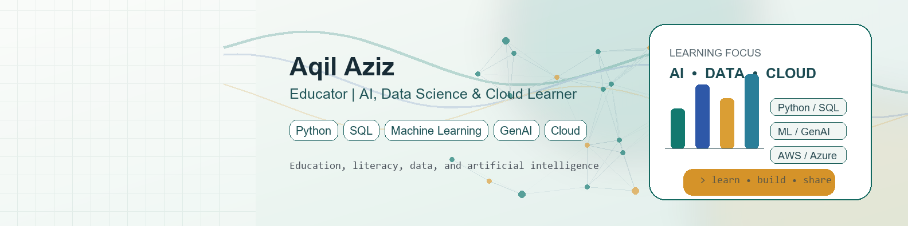

# Hi, I'm Aqil Aziz

I am an educator from East Java, Indonesia, currently growing my skills in **AI, data science, cloud computing, and software development**.

My background is in education, literacy, and Islamic thought. I enjoy connecting those foundations with practical technology: building useful tools, learning modern development workflows, and exploring how AI and data can support learning, automation, and decision-making.

## Current Focus

- AI and Generative AI for education and productivity
- Data Science with Python, SQL, and visualization
- Cloud fundamentals across AWS, Google Cloud, and Microsoft Azure
- Web development with TypeScript, JavaScript, PHP, and Go
- Building simple, useful systems for schools, small businesses, and daily operations

## Tech Stack

## Selected Projects

| Project | Focus |
| --- | --- |
| [ai-english-tutor](https://github.com/aqilaziz/ai-english-tutor) | AI chatbot for practicing spoken English |
| [lakasir](https://github.com/aqilaziz/lakasir) | Simple open-source POS system |
| [actual](https://github.com/aqilaziz/actual) | Local-first personal finance app |
| [layananlaundry](https://github.com/aqilaziz/layananlaundry) | Laundry service application |
| [fullstack_nextjs_santrikoding](https://github.com/aqilaziz/fullstack_nextjs_santrikoding) | Full-stack learning project with Next.js |

## Learning Path

Recently completed learning areas include:

- Machine Learning and AI fundamentals
- Generative AI with Microsoft Azure
- Data Science, SQL, and data visualization
- Cloud fundamentals with AWS and Google Cloud
- DevOps fundamentals
- Programming with Python, JavaScript, Dart, Haskell, Go, and TypeScript

## GitHub Stats

  
  

## Connect

- GitHub: [github.com/aqilaziz](https://github.com/aqilaziz)
- LinkedIn: [Aqil Aziz](https://www.linkedin.com/in/aqil-aziz-0489a014a/)

I am open to learning collaborations, education technology projects, and practical discussions around AI, data, and digital literacy.
