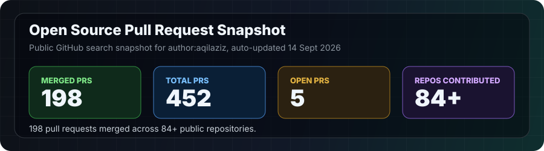

# Hi 👋 I'm Aqil Aziz

<div align="center">

### AI Agent Tooling · Full-Stack Developer · Educator

**Building practical AI systems, developer tools, and education technology — based in East Java, Indonesia 🇮🇩**


</div>

---

## About

- 🤖 Contribute to open-source AI agent infrastructure — [ZizkaDB](https://github.com/Zizka-ai/ZizkaDB), [openclaw](https://github.com/openclaw/openclaw), [openhuman](https://github.com/tinyhumansai/openhuman)
- 💻 Build full-stack apps with Next.js, TypeScript, Supabase, PostgreSQL
- 🎓 Educator at MAM 1 Paciran Lamongan — teaching digital literacy and software engineering
- 🌏 Focused on AI tools for Indonesian education and student communities

## Open-source contributions

| Project | What I shipped |
|---------|-----------------|
| [Zizka-ai/ZizkaDB](https://github.com/Zizka-ai/ZizkaDB) | SQL bug fixes, LangChain callback handlers, security hardening, 60+ new tests — **3 PRs merged** |
| [tinyhumansai/openhuman](https://github.com/tinyhumansai/openhuman) | Docker/installer fixes, error classification, Indonesian i18n polish — **57+ PRs merged** |
| [openclaw/openclaw](https://github.com/openclaw/openclaw) | Indonesian i18n (88 strings), read-tool image delivery, cross-platform test fixes |

## Featured projects

- **[beasiswacoach-ai](https://github.com/aqilaziz/beasiswacoach-ai)** — AI scholarship coach for Indonesian students · [live demo](https://beasiswacoach-ai.vercel.app)
- **[buildaimamsaka](https://github.com/aqilaziz/buildaimamsaka)** — production student portfolio platform, Next.js 15 + Supabase, in active use at MAM 1 Paciran
- **[geraicerdas-ai](https://github.com/aqilaziz/geraicerdas-ai)** — AI business copilot for Indonesian MSMEs

## Stack

```
Languages   TypeScript · Python · SQL · JavaScript
Frontend    React · Next.js · Tailwind CSS
Backend     Supabase · PostgreSQL · FastAPI · Node.js
AI          LangChain · MCP · OpenAI/Anthropic APIs · vector DBs
Testing     Vitest · pytest
Tooling     GitHub Actions · Docker
```

---

## Open-source pull request metrics

<p align="center">
  
</p>

*Auto-updated every 6 hours via GitHub Actions.*

## GitHub activity

<p align="center">
  
  
</p>

<p align="center">
  
</p>

<p align="center">
  
</p>

---

## Connect

<p align="center">
  <a href="https://www.linkedin.com/in/aqil-aziz-0489a014a/"></a>
  <a href="https://github.com/aqilaziz"></a>
</p>

<p align="center"><i>Open to collaboration on AI agent tooling, Indonesian localization, and education-focused tech.</i></p>

