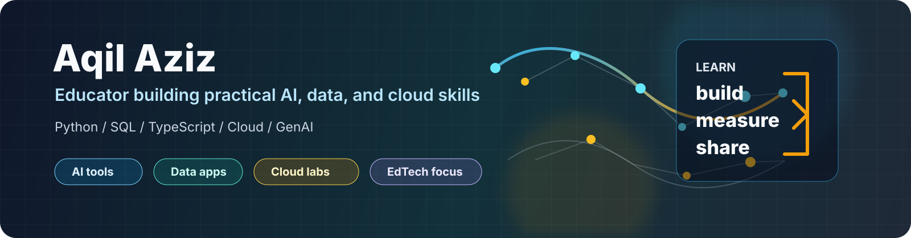

# Hi, I'm Aqil Aziz 👋

> Educator from East Java, Indonesia — building practical AI, full-stack, and data tools that bring technology into classrooms and communities.

  
  
  

I work at the intersection of **education and applied technology**: AI-assisted learning workflows, automation tools, data projects, and web apps that support schools, communities, and everyday operations.

- 🔭 Currently building AI learning workflows and full-stack apps with React, Next.js & Supabase
- 🌱 Deepening Generative AI, MLOps, and cloud fundamentals
- 🤝 Open to collaboration on AI for education, React/Supabase projects, and open source
- 📫 Reach me on [LinkedIn](https://www.linkedin.com/in/aqil-aziz-0489a014a/)

## 🎯 Focus Areas

- **AI & Generative AI** — learning workflows, productivity, agent tooling, knowledge systems
- **Full-stack web** — React, Next.js, TypeScript, Supabase, PostgreSQL, modern APIs
- **Data & automation** — Python, SQL, dashboards, visualization
- **Cloud & DevOps** — AWS, Google Cloud, Azure, GitHub Actions
- **EduTech** — practical, project-based digital literacy

## 🛠️ Tech Stack

**AI & Languages**

**Frameworks & Data**

**Cloud & DevOps**

## 🚀 Featured Projects

| Project | Focus |
| --- | --- |
| [beasiswacoach-ai](https://github.com/aqilaziz/beasiswacoach-ai) | 🎓 AI scholarship coach for Indonesian students |
| [buildaimamsaka](https://github.com/aqilaziz/buildaimamsaka) | 🏗️ Student portfolio platform — Next.js 15 + Supabase |
| [geraicerdas-ai](https://github.com/aqilaziz/geraicerdas-ai) | 🤖 AI business copilot for Indonesian MSMEs |
| [gitmark](https://github.com/aqilaziz/gitmark) | 📌 GitHub link organizer & bookmark manager |
| [ZizkaDB](https://github.com/aqilaziz/ZizkaDB) | 🗄️ Operational database for AI agents (contributor) |

## 📊 GitHub Stats

  
  

  

  

## 🤝 Connect

Open to collaboration around **AI for education, React/Supabase projects, data automation, and open-source documentation.**
