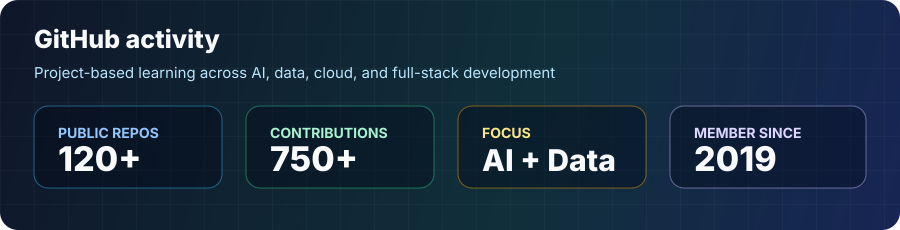

# Hi, I'm Aqil Aziz

I am an educator from East Java, Indonesia, learning and building at the intersection of **AI, data, cloud computing, and software development**.

My work starts from education and digital literacy, then moves into practical technology: small automation tools, learning projects, data workflows, and web systems that can support schools, communities, and daily operations.

## What I am building toward

- Applying AI and Generative AI to learning, productivity, and knowledge workflows
- Turning data into clearer decisions with Python, SQL, dashboards, and visualization
- Building full-stack web applications with TypeScript, JavaScript, PHP, Go, and cloud services
- Improving digital literacy through practical, project-based technology education

## Current stack

## Featured work

| Project | Focus |
| --- | --- |
| [q-build-ai](https://github.com/aqilaziz/q-build-ai) | AI build experiments and learning practice |
| [fullstack_nextjs_santrikoding](https://github.com/aqilaziz/fullstack_nextjs_santrikoding) | Full-stack Next.js implementation practice |
| [layananlaundry](https://github.com/aqilaziz/layananlaundry) | Laundry service web application built with TypeScript |
| [gol1-sankod](https://github.com/aqilaziz/gol1-sankod) | Go programming practice project |
| [ai-english-tutor](https://github.com/aqilaziz/ai-english-tutor) | AI-based spoken English practice exploration |
| [browsertrace](https://github.com/aqilaziz/browsertrace) | Browser-agent debugging and Playwright workflow exploration |

## Learning log

Recently active around:

- Machine Learning and Generative AI fundamentals
- Data Science, SQL, and visualization
- Cloud fundamentals across AWS, Google Cloud, and Microsoft Azure
- DevOps basics and modern development workflows
- Programming practice with Python, TypeScript, Go, PHP, and JavaScript

## GitHub activity

## Connect

- GitHub: [github.com/aqilaziz](https://github.com/aqilaziz)
- LinkedIn: [Aqil Aziz](https://www.linkedin.com/in/aqil-aziz-0489a014a/)

Open to learning collaborations, education technology projects, and practical conversations around AI, data, cloud, and digital literacy.
